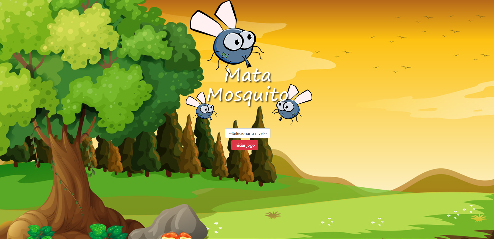
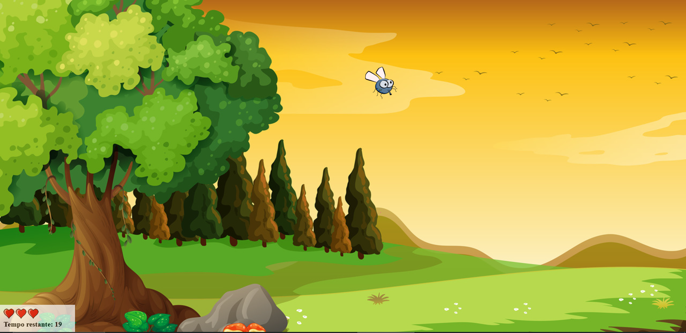
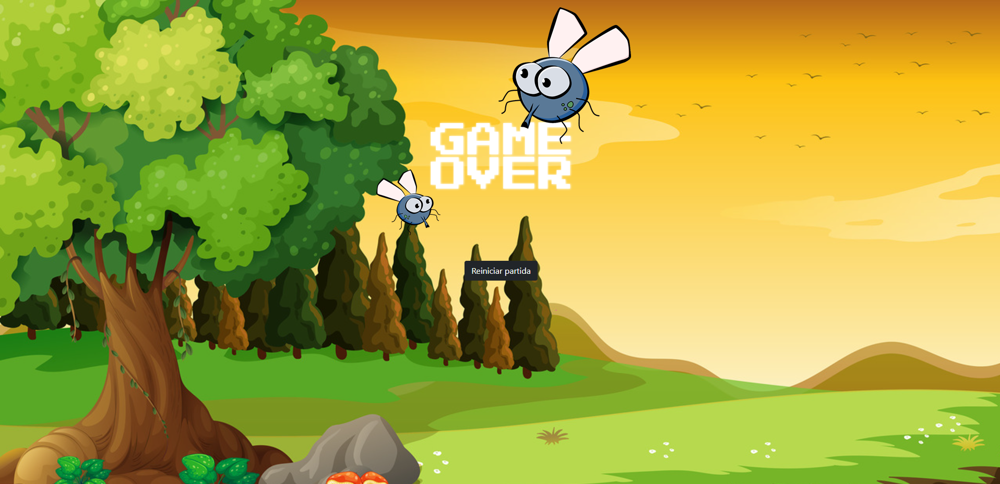

# Mata Mosquito

O **Mata Mosquito** é um jogo interativo desenvolvido com **HTML**, **CSS** e **JavaScript**. O objetivo do jogo é matar o maior número de mosquitos que aparecem de forma aleatória na tela, com diferentes tamanhos. O jogo permite ao usuário escolher a dificuldade, que afeta o tempo de aparição dos mosquitos. O jogo termina quando o tempo se esgota ou o jogador decide finalizar.

## Funcionalidades

- **Escolha de Dificuldade**: O jogador pode escolher entre diferentes níveis de dificuldade, que alteram a frequência com que os mosquitos aparecem na tela.
- **Mosquitos Aleatórios**: Os mosquitos aparecem em posições aleatórias e com tamanhos variados, tornando o jogo mais dinâmico e desafiador.
- **Tela de Game Over**: Quando o tempo acaba ou o jogador decide terminar o jogo, uma tela de "Game Over" é exibida com a pontuação final.

## Telas do Jogo

1. **Tela Inicial**:
   - O jogador pode escolher a dificuldade do jogo. As opções de dificuldade alteram o tempo em que os mosquitos aparecem na tela.
   - As dificuldades disponíveis são:
     - Fácil
     - Médio
     - Difícil




2. **Tela do Jogo**:
   - Os mosquitos começam a aparecer de forma aleatória na tela, com tamanhos diferentes.
   - O jogador deve clicar nos mosquitos para eliminá-los e ganhar pontos.
   - A quantidade de tempo entre o aparecimento dos mosquitos diminui conforme a dificuldade selecionada.


   

3. **Tela de Game Over**:
   - Quando o tempo do jogo se esgota, ou quando o jogador perde todas as vidas, ou quando o jogador decide terminar, a tela de "Game Over" é exibida.
   - A tela mostra a pontuação final do jogador.


   

## Tecnologias Utilizadas

- **HTML5**: Estrutura da página e conteúdo.
- **CSS**: Estilos personalizados para o layout.
- **JavaScript**: Lógica do jogo, como a criação aleatória dos mosquitos e a detecção de cliques para matar os mosquitos.

## Como Rodar o Projeto

1. Clone o repositório:
   ```bash
   git clone git@github.com:nicolas-marques/mata-mosquito.git
